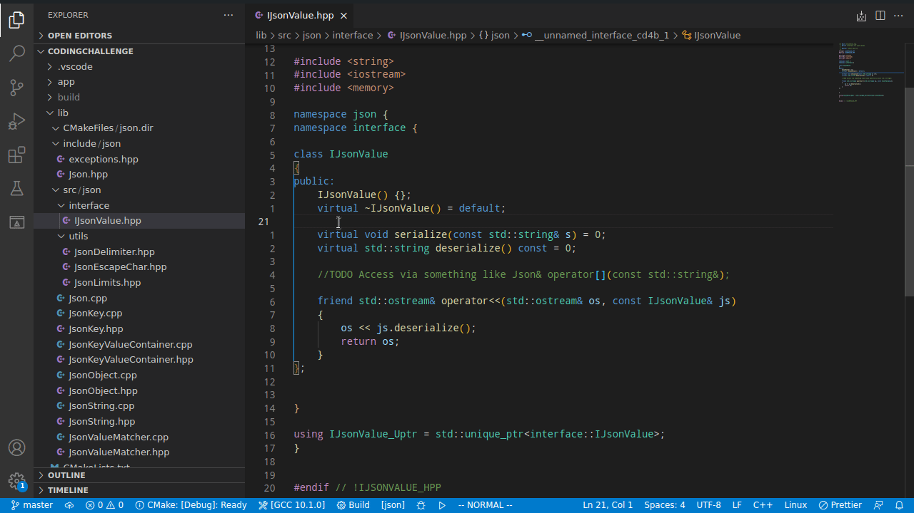
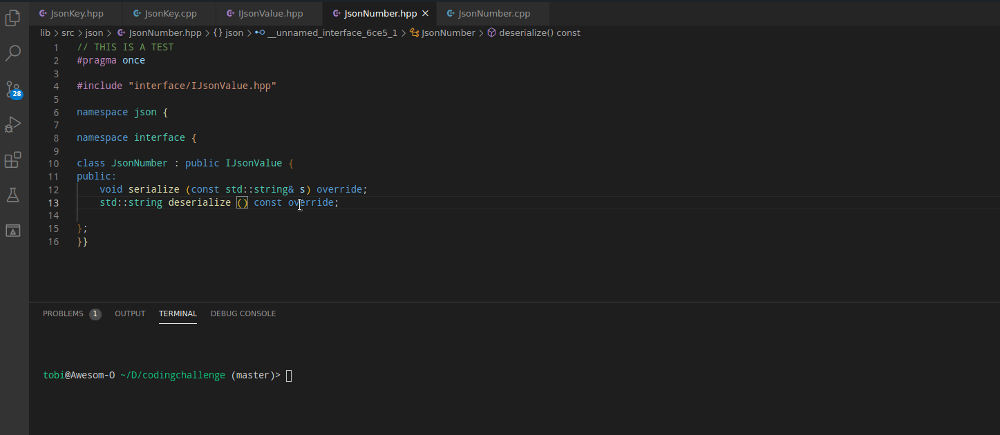

# codegen-cpp README

I grew tired of "writing" C++ definition stubs by copying around declarations from (interface) header files. Thus I wrote this extension, which helps generating said stubs from a header file. Additionally it allows creating the necessary files for an implementation of a given interface.  Multiline declarations and nested classes/namespaces are supported.
Still not perfect, but should work for the most common use cases.
## Features
The extension is automatically loaded when using the C++ language. 
The following commands are provided while a C++ header file (extension: `hpp`, `h`, `hxx`, `hh`)  is open in the editor:

* `codegen-cpp:  Generate interface implementation source/header files` : Parses the currently opened header file and generates implementation stubs for all available interfaces. The names of the interface implementations can be provided via the UI.

* `codegen-cpp: Generate source file from header` : Parses the currently opened header file and generates the source stubs. The output directory can be provided via the UI. In case a source file exists, changes can be evaluated with the refactoring view;

## Extension Settings

The following settings are available:

* `codegen-cpp.FileHeader.ForC++Source`: File header which is added at the top of each generated C++ source file
* `codegen-cpp.FileHeader.ForC++Header"`: File header which is added at the top of each generated C++ header file
* `codegen-cpp.OutputFileExtension.ForC++Header`: File extension used when generating C++ header files
* `codegen-cpp.OutputFileExtension.ForC++Source`: File extension used when generating C++ source files
* `codegen-cpp.deduceOutputFileNames`: Whether the output file name(s) should be deduced when generating:
    * Source from Header: by keeping the base name
    * Interface implementations: by using the name of the (first) implementation
    Else the file base name has to be entered via the UI.

## Issues
Can be reported [here](https://github.com/HerrFroehlich/vscode_cpp_codegen/issues). Contributions are also welcome in any form.
### Known
#### Major
* Updating existing header files is not supported
* `using` statements are not evaluated
* `struct`s are not supported
* Newly created folders are not detected for selection until reloading VS-Code window
* friend declarations parsed wrongly
* preprocessor macros after `class` specifier are not working

#### Minor, internal
* enum classes are deserialized as classes 

## Possible features in future
* Generating code only for selected text ranges
* Prettifying the generated output 
* more configuration possibilities (e.g. for namespaces)
* Generating abstract factories
* ...
## Release Notes

### 0.1.1

- fixed:  Serialization of nested classes
- fixed:  Too many remaining new line feeds when merging source files
### 0.1.0

Initial release for testing the two generator features: source stubs and generating interface implementing stubs

-----------------------------------------------------------------------------------------------------------
