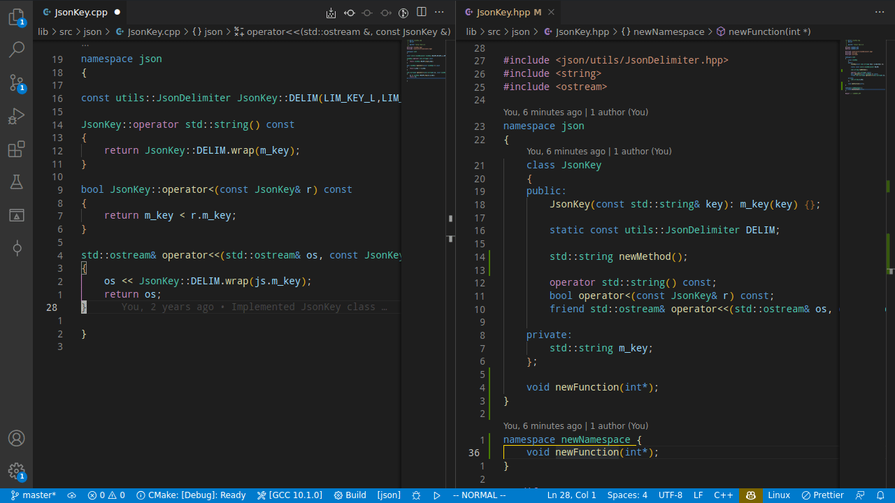

# codegen-cpp README

I grew tired of "writing" C++ definition stubs by copying around declarations from (interface) header files. Thus I wrote this extension, which helps generating said stubs from a header file. Additionally it allows creating the necessary files for an implementation of a given interface. Multiline declarations and nested classes/namespaces are supported.
Still not perfect, but should work for the most common use cases.

## Features

The extension is automatically loaded when using the C or C++ language.
The following commands are provided while a C/C++ header file is open in the editor:

- `codegen-cpp: Generate interface implementation source/header files` : Parses the currently opened header file and generates implementation stubs for all available interfaces. The names of the interface implementations can be provided via the UI.
- `codegen-cpp: Generate interface implementation source/header stub(s) for selection`: Same as above, but only for a certain text selection in the currently opened header file

  

- `codegen-cpp: Generate source file from header`: Parses the currently opened header file and generates source stubs for the given declarations.
- `codegen-cpp: Generate source stub(s) for selection`: Same as above, but only for a certain text selection in the currently opened header file

  

- `codegen-cpp: Generate abstract factory(s) from header`: Parses the currently opened header file and generates abstract factory interfaces for the given classes.
- `codegen-cpp: Generate abstract factory(s) from header for selection`: Same as above, but only for a certain text selection in the currently open header file

Additional features:

- `Source file auto completion`: Provides completion items for missing defintions in a source file (namespace aware). Displaying the completion items can also be triggered by typing a configurable character (default: `.`) in an empty line. Currently this only works if there is a header file with a matching name next to the current source file.
  
- `Merging header/source files`: in case new file is generated, but one with the same name already exists, a refactoring preview is displayed in VS Code to help merging the files manually (configurable)
- `Directory Quick Picker`: You can select the output directory of the created files easily and fastly via a VS Code quick pick (configurable)
- custom, configurable file headers for the generated files
- names of to newly created files can be either entered via an input field or deduced from a namepattern

## Issues

Can be reported [here](https://github.com/HerrFroehlich/vscode_cpp_codegen/issues). Contributions are also welcome in any form.

### Known

- `using` statements are not evaluated
- preprocessor macros after `class` specifier are not working
- enum classes are deserialized as classes
- default constructors/destructors are not detected

## Possible features in future

- Prettifying the generated output
- more configuration possibilities (e.g. for namespaces)
- ...

## Release Notes

### 0.4.0

- feat: Language support for C
- feat: Stub definition auto completion in a source file in case there is a header file with matching name next to it
- fix: enable commands also for custom header extensions

### 0.3.2

- reworked directory quick pick
- fix: missing header guards

### 0.3.1

- Rerelease due to faulty bundling, new commands are not available

### 0.3.0

- added: Creating abstract factories from a header
- added: Namepattern support for interfaces/abstract factories
- fix: UI directory selection not working
- fix: Name input dialogue is only shown for interfaces when generating implementation stubs

### 0.2.1

- fixed: crash when merging a previously empty file
- fixed: formatting issues
- added: option to toggle refactoring preview on/off

### 0.2.0

- feature: context menus
- feature: generating stubs for a text selection
- feature: Merging header files
- fix: missing namespaces in header when using prepended mode

### 0.1.4

- fix: No longer generate empty namespaces
- fix: Error handling:
  - warn instead of silently fail
  - warn if nothing is generated
- fix: directory QuickPick:
  - does no longer automatically change the filter value when the active item changes
  - instead update the filter only when a new item with different label is selected (with ENTER)
  - added a "GoBack" item (..) to quickly select the parent directory of the current filter value

### 0.1.3

- added: configuration for the namespace serialization mode
- added: support for structs
- fixed: new line artificats when merging source files
- fixed: serialization of friend functions
- fixed: window reload no longer required for certain configurations
- fixed: directory scan for large folders

### 0.1.2

- fixed: Parsing of cast and (de)allocation operators
- fixed: Updating folder quick pick choices on folder creation/deletion
- added: settings to ignore certain folders (json array or from `.gitignore`)
- added: setting to choose how output directories are selected (None/QuickPick/UI dialogue)
- improved directory QuickPick handling

### 0.1.1

- fixed: Serialization of nested classes
- fixed: Too many remaining new line feeds when merging source files

### 0.1.0

Initial release for testing the two generator features: source stubs and generating interface implementing stubs

---
